# ☁️ Tayyab Masood | Cloud Solutions Architect & DevOps Lead

  <b>Bridging the Gap Between Software Engineering & Cloud Infrastructure</b> 
  <i>Stateless Architectures • Automated CI/CD Pipelines • Container Orchestration • High Availability</i>

---

## 📌 Executive Overview

I am a **Cloud Solutions Architect & Senior DevOps Engineer** with over 6 years of core IT systems engineering and 3+ years specializing in enterprise cloud architecture, automated continuous delivery (CI/CD), and full-stack software development.

My operational philosophy focuses on **"Build + Run"**: designing software with production cloud constraints in mind from day one, eliminating deployment friction through automated delivery pipelines, and enforcing strict fault tolerance and security standards.

```mermaid
flowchart LR
    A[Code Commit / PR] --> B[GitHub Actions CI]
    subgraph CI_Pipeline ["Continuous Integration & Security"]
        B --> C[ESLint / Static Analysis]
        C --> D[Multi-Stage Docker Build]
        D --> E[Trivy Vulnerability Scan]
    end
    E --> F[Container Registry ECR / GHCR]
    subgraph CD_Rollout ["Automated Cloud Delivery (IaC)"]
        F --> G[Terraform State Validation]
        G --> H[Kubernetes EKS Cluster]
        H --> I[Horizontal Pod Autoscaler]
        I --> J[Zero-Downtime Rolling Update]
    end
    J --> K[Prometheus & Grafana Observability]
```

---

## 🛠️ Technology & Infrastructure Matrix

<table>
  <thead>
    <tr>
      <th>Domain</th>
      <th>Technologies, Frameworks & Tooling</th>
    </tr>
  </thead>
  <tbody>
    <tr>
      <td><b>Cloud Platforms & IaC</b></td>
      <td>
        
        
        
        
        
      </td>
    </tr>
    <tr>
      <td><b>Containers & Orchestration</b></td>
      <td>
        
        
        
        
        
      </td>
    </tr>
    <tr>
      <td><b>CI/CD & DevSecOps</b></td>
      <td>
        
        
        
        
        
      </td>
    </tr>
    <tr>
      <td><b>Full-Stack Development</b></td>
      <td>
        
        
        
        
        
        
      </td>
    </tr>
    <tr>
      <td><b>Databases & Caching</b></td>
      <td>
        
        
        
        
        
      </td>
    </tr>
  </tbody>
</table>

---

## 📂 Featured Repositories & Engineering Showcases

### 1. [cloud-devops-cicd-blueprint](https://github.com/T9113/cloud-devops-cicd-blueprint)
> **Production-Grade AWS, Kubernetes, Terraform & Automated CI/CD Architecture**
- Production-ready cloud delivery blueprint featuring AWS multi-AZ VPC, Kubernetes HPA, and automated GitHub Actions CI/CD with Trivy vulnerability scanning.
- **Tags:** `terraform`, `kubernetes`, `aws-eks`, `devsecops`, `trivy`, `docker`, `ci-cd`, `github-actions`

### 2. [python-aws-cicd-pipeline](https://github.com/T9113/python-aws-cicd-pipeline)
> **Automated AWS CI/CD Pipeline for Containerized Python Applications**
- Automated GitHub Actions workflow testing Python code, building multi-stage Docker containers, and executing automated rollouts to AWS infrastructure.
- **Tags:** `aws`, `cicd`, `docker`, `github-actions`, `python`, `devops`

### 3. [modern-react-app](https://github.com/T9113/modern-react-app)
> **Enterprise React & TypeScript Application Frontend**
- Clean architecture with TypeScript type safety, modular state management, custom hooks, and optimized bundle splitting.
- **Tags:** `react`, `typescript`, `frontend`, `tailwindcss`, `saas`

### 4. [mern-auth](https://github.com/T9113/mern-auth)
> **Production-Ready JWT & OAuth Authentication Microservice**
- Secure multi-factor and token-based authentication workflows (access/refresh token rotation, bcrypt hashing, cookie security).
- **Tags:** `nodejs`, `mongodb`, `express`, `jwt`, `authentication`, `security`

### 5. [Diagnosis-AI](https://github.com/T9113/Diagnosis-AI)
> **AI-Assisted Diagnostic & Automation Intelligence Engine**
- Harnessing LLM workflows and automated data processing pipelines for intelligent operational diagnostics.
- **Tags:** `ai`, `openai`, `automation`, `python`, `diagnostics`

---

## 🏛️ Core Engineering Competencies & Architecture Focus

- **Cloud & DevOps Engineering:** Multi-account AWS landing zones, Terraform IaC, Docker/Kubernetes container orchestration, and FinOps cost optimization.
- **24/7 Managed Cloud Infrastructure:** Zero-downtime server maintenance, automated backup drills, and proactive metrics alerting.
- **Full-Stack SaaS & Web Platforms:** High-performance Next.js frontends, scalable Node.js/Laravel APIs, and robust payment integrations.
- **AI Integrations & Workflow Automation:** Custom OpenAI API pipelines, automated webhooks, and ETL processing.

---

## 📬 Contact & Connect

Feel free to connect directly for architecture consulting, contract engagements, or technical partnerships:

- **LinkedIn:** [linkedin.com/in/tayyabmasood911](https://www.linkedin.com/in/tayyabmasood911)
- **Direct Email:** [tayyabmasood911@gmail.com](mailto:tayyabmasood911@gmail.com)
- **Fiverr Orders:** [fiverr.com/tayyabmasood212](https://www.fiverr.com/tayyabmasood212)
