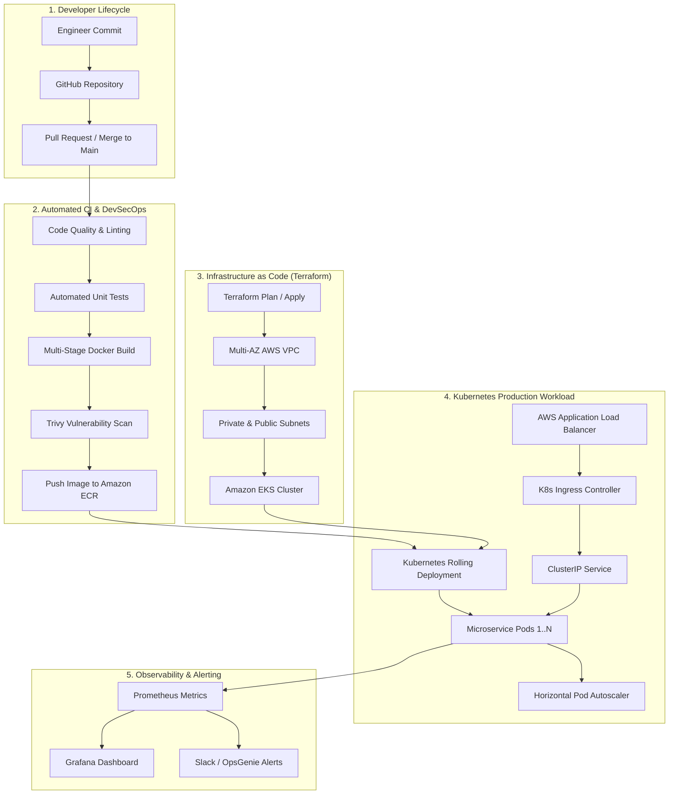

# 🚀 Enterprise Cloud & DevOps CI/CD Blueprint
### Production-Grade AWS, Kubernetes, Terraform & Automated CI/CD Architecture

[](https://github.com/T9113)
[](https://www.terraform.io/)
[](https://kubernetes.io/)
[](https://www.docker.com/)
[](https://aquasecurity.github.io/trivy/)
[](LICENSE)

---

## 📖 Overview

This repository demonstrates a **battle-tested, production-grade cloud delivery architecture** engineered by **Tayyab Masood (Cloud Solutions Architect & DevOps Lead)**.

It provides a repeatable reference blueprint implementing:
- **Infrastructure as Code (IaC):** Modular Terraform configurations managing multi-AZ AWS networking (VPC, public/private subnets, NAT gateways, security groups).
- **Container Hardening:** Multi-stage Docker builds running as non-root users on minimal distroless/Alpine base images.
- **Continuous Integration (CI):** Automated linting, unit testing, and Trivy CVE vulnerability scanning on every pull request.
- **Continuous Delivery (CD):** Zero-downtime rolling updates to Amazon Elastic Kubernetes Service (EKS) with Horizontal Pod Autoscaling (HPA) and automated rollback triggers.
- **Proactive Observability:** Native Prometheus scraping endpoints, health check probes, and structured JSON logging.

---

## 🏛️ System Architecture



---

## 📁 Repository Structure

```text
├── .github/
│   └── workflows/
│       └── ci-cd-pipeline.yml    # Full CI/CD pipeline definition
├── docker/
│   ├── Dockerfile                # Multi-stage, non-root secure container build
│   └── .dockerignore             # Optimized build context
├── k8s/
│   ├── deployment.yaml           # Deployment with rolling update strategy & probes
│   ├── service.yaml              # ClusterIP service configuration
│   ├── ingress.yaml              # Ingress routing with TLS termination
│   └── hpa.yaml                  # Horizontal Pod Autoscaler (2 to 10 pods)
├── terraform/
│   ├── main.tf                   # AWS VPC, Subnets, Gateways & Security Groups
│   ├── variables.tf              # Configurable infrastructure variables
│   └── outputs.tf                # VPC ID, Subnet IDs, and Cluster endpoints
└── README.md                     # Architecture documentation
```

---

## 🚀 Quickstart & Deployment

### 1. Infrastructure Provisioning (Terraform)
```bash
cd terraform
terraform init
terraform plan -out=tfplan
terraform apply tfplan
```

### 2. Container Build & Local Run
```bash
# Build multi-stage container
docker build -t cloud-blueprint:v1.0.0 -f docker/Dockerfile .

# Run container locally as non-root user
docker run -d -p 8080:8080 --name cloud-app cloud-blueprint:v1.0.0
```

### 3. Kubernetes Deployment
```bash
# Apply Configs and Deployments
kubectl apply -f k8s/deployment.yaml
kubectl apply -f k8s/service.yaml
kubectl apply -f k8s/ingress.yaml
kubectl apply -f k8s/hpa.yaml

# Verify Rollout Status
kubectl rollout status deployment/cloud-blueprint-app
```

---

## 🛡️ Security & DevSecOps Best Practices

1. **Least-Privilege Security Context:** Containers run as an unprivileged user (`UID: 10001`) with read-only root filesystems where applicable.
2. **Shift-Left Vulnerability Scanning:** Every build is analyzed by **Trivy** in the CI pipeline; builds fail if `CRITICAL` CVEs are identified.
3. **Graceful Shutdown & Zero-Downtime:** `preStop` hooks and `terminationGracePeriodSeconds` allow in-flight connections to drain before pod termination.
4. **Secret Management:** Sensitive credentials are never baked into container images or checked into Git; injected dynamically via AWS Secrets Manager or Kubernetes Secrets.

---

## 👨‍💻 Author & Architecture Inquiries

**Tayyab Masood**  
- **Role:** Cloud Solutions Architect & Senior DevOps Engineer  
- **Certifications:** AWS Certified Solutions Architect (SAA), Google IT Support Professional  
- **GitHub:** [@T9113](https://github.com/T9113)  
- **LinkedIn:** [linkedin.com/in/tayyabmasood911](https://www.linkedin.com/in/tayyabmasood911)  
- **Email:** [tayyabmasood911@gmail.com](mailto:tayyabmasood911@gmail.com)  
